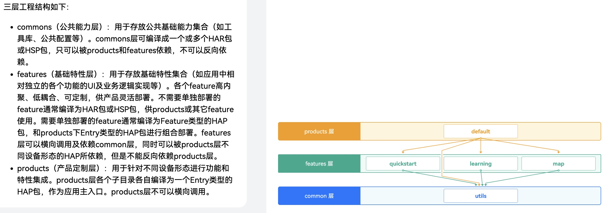
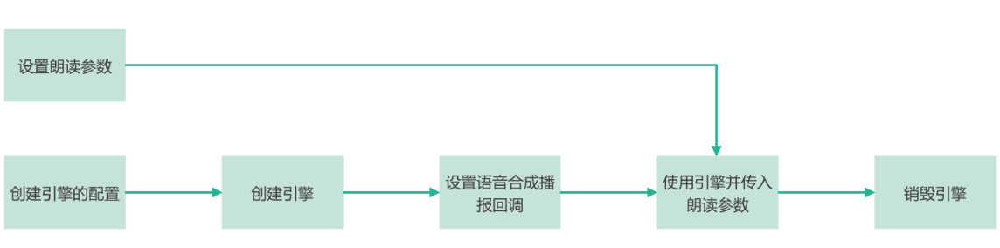

## Title
鸿蒙 OS 开发入门 (HarmonyOS Basic)
## Version
v1.0.1
## Commit logs
- 2024-10-26 使用MVVM三层架构调整代码组织，层次化、模块化代码结构，方便扩展和多人协同

- 2024-10-26 增加课程学习页面，通过 webview 加载课程学习页面
- 2024-10-27 增加知识地图+详情页面，学习通过数据结构化数据构建页面

- 2024-10-27 使用 Tabs 组件实现多页面之间的平级切换
- 2024-10-27 使用 Navigation 组件实现模块内的路由跳转
- 2024-10-28 增加TTS文本转语音能力
